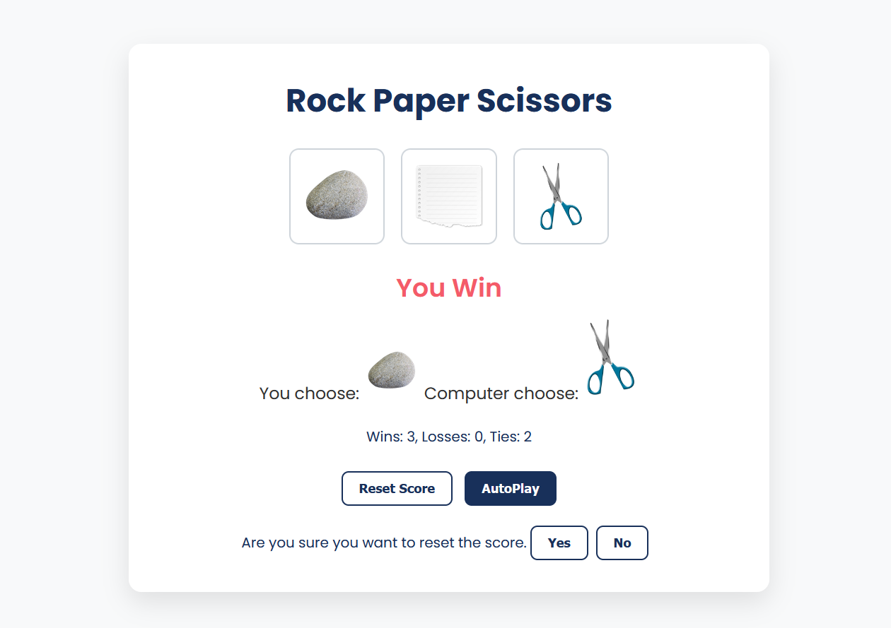

# ✊✋✌️ Rock Paper Scissors Game

A modern, fully responsive Rock-Paper-Scissors game built with **HTML**, **CSS**, and **JavaScript**. This is a fun browser-based mini-game perfect for portfolios or JavaScript practice.

## 📸 Screenshot

## 🔗 Live Demo

👉 [Click here to play](https://rockpaperscissorsgamebysidra.netlify.app/)

## 🚀 Features

- Fully responsive on desktop, tablet, and mobile
- Clean and modern UI with smooth interactions
- Auto Play mode for simulation
- Reset score functionality

## 🛠 Tech Stack

- HTML5
- CSS3 (Flexbox + Media Queries)
- Vanilla JavaScript

## 📂 Folder Structure

📁 project/
├── index.html
├── style.css
├── script.js
├── Newfolder/
│ ├── rock-emoji.png
│ ├── paper-emoji.png
│ └── Scissors-emoji.png

## 🖥 How to Run

1. Download or clone the repository
2. Open `index.html` in your browser
3. Enjoy the game!

## 📝 License

This project is licensed under the [MIT License](LICENSE).
